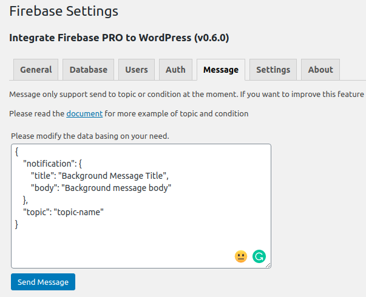
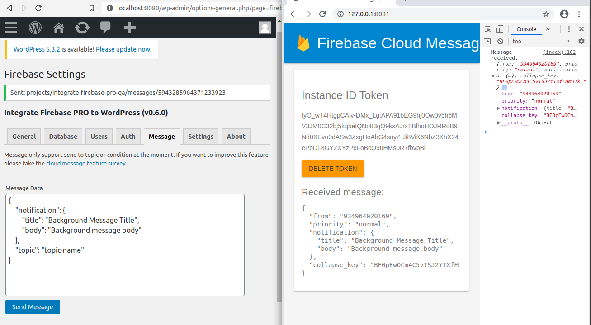
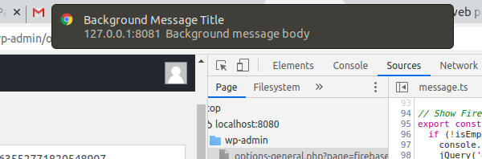

Firebase Cloud Message Integration
=============

This feature only helps you to send notification or data to a topic. In order to improve this feature, you can participate in `this 3 minutes survey <https://forms.gle/LwaMqQfxeJjy5iBj7>`_.

In order to use this feature, you need to update the plugin's cloud functions to at least v0.6.0 which comes together with the Integrate Firebase PRO plugin.

After that, you can go to WordPress dashboard > **Settings > Firebase > Message**, prepare your message and send it.

There is a sample notification in the Message tab, that will send a notification to "toptic-name" topic. You will have to modify it basing on your needs.

    Sample notification message

This is the structure of the message. You can send a notification or data to a specific topic. Below are samples of the message. If you want to learn more on the message structure, please check the `firebase send message documentation <https://firebase.google.com/docs/cloud-messaging/send-message#send-messages-to-topics>`_.

You also can send notification together with data.

.. code-block:: bash

    // Send notification
    {
        "notification": {
            "title": "Background Message Title",
            "body": "Background message body"
        },
        "topic": "topic-name"
    }

.. code-block:: bash

    // Send data
    {
        "data": {
            "score": "850",
            "time": "2:45"
        },
        "topic": "topic-name"
    }

If the message is sent successfully, you will see a messge.

    Successfully sent a message

If you send a notification to a topic, and website is in the background, this is what user will see.

    Background notification
