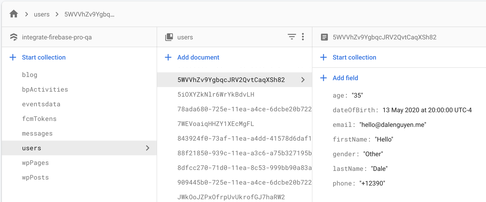

Firebase User Profile on WordPress
=============

You have ability to manage Firebase Users account from WordPress. For example, User is managed in Firestore under **‘users‘** collection and the document is the Firebase UID.

Then you can create a Contact 7 form with the fields that represent your users information.

*Note: the form only supports text, tel, number, date and radio at the moment.

Create User Profile Fields with Contact Form 7
----------------------------------

For example, User profile will be saved to Firebase under **users** collection, the document is the firebase UID. 

Remember to set the security rule that only allows user to update their own data.

.. code-block:: bash

    // Example of Firestore security rule
    match /users/{userId} {
        allow read, write: if request.auth.uid == userId;
    }

Sample Firebase User Profile structure in Firestore

    User Profile structure

Contact 7 form sample for user management

.. code-block:: php

    // If you add class "getFirebaseUid" to any inputs, it will return the current user uid automatically

    [hidden databaseType "firestore"]
    [hidden collectionName "users"]
    [hidden documentId class:getFirebaseUid "INVALID"]
    [hidden collectionName "users"]
    [hidden dateType "dateOfBirth"]

    [text* firstName placeholder "First Name"]
    [text* lastName placeholder "Last Name"]
    [text* email placeholder "Email"]
    [tel phone placeholder "+1 647 620 0000"]
    Age

    [number age id:age min:1 max:100]
    Date of Birth

    [date* dateOfBirth id:dateOfBirth]
    Gender

    [radio gender id:gender default:1 "Male" "Female" "Other"]

    [submit "Submit"]

Create Firebase User Account Page
----------------------------------    

This step is easy, you can create a Page on WordPress, then put the following shortcode to the page. Then you will have an account page that users can manage their profile information.

.. code-block:: php

    // html_id="ifp-firebase-account" is required

    [contact-form-7 id="188" html_id="ifp-firebase-account" title="Firebase Account"]

Demo site: https://wordpress.dalenguyen.me/firebase-account/