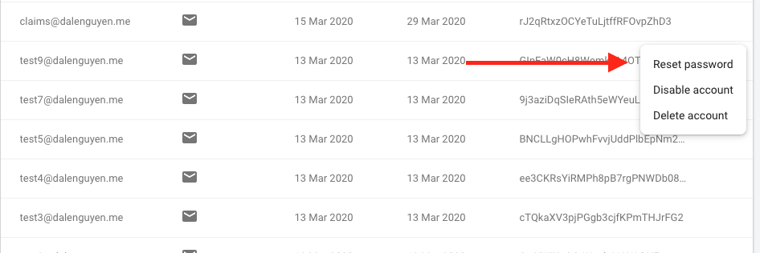
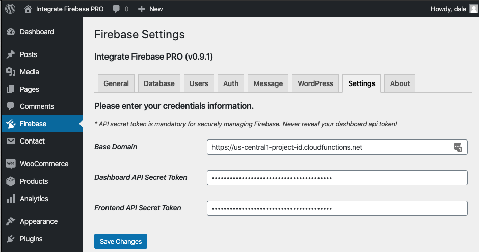
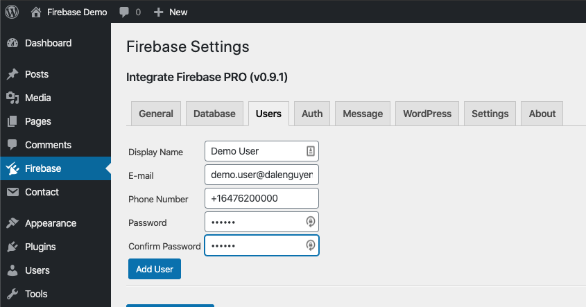
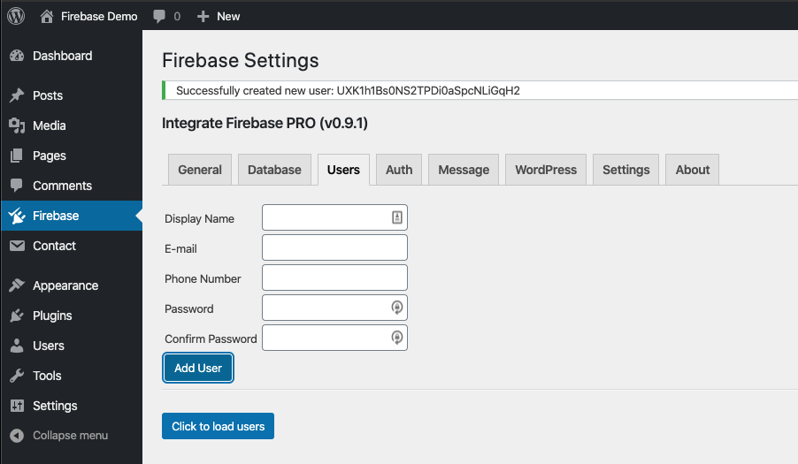
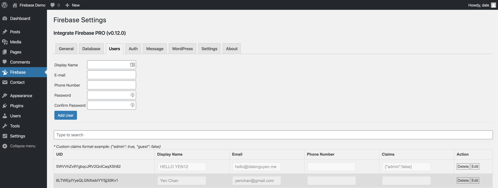
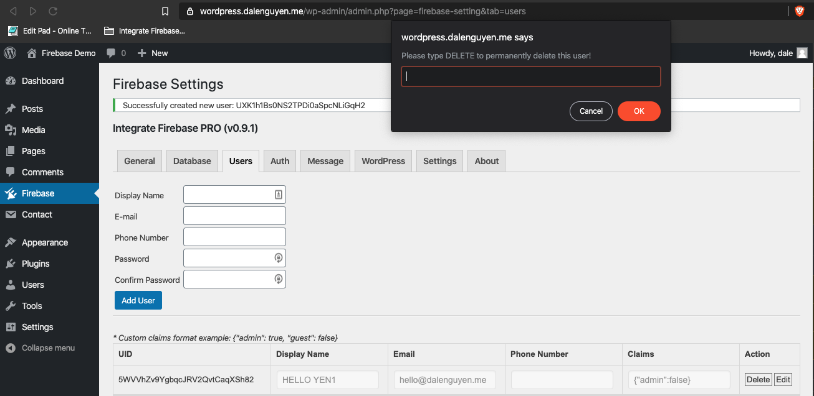

Manage Firebase Users in WordPress Dashboard
=============

Google provided a great tool for authentication. However, it is not convenient in terms of user management. As you can see, the options are limited. 

    Firebase default options

That is why I want to make it easier for the webmaster if they want to create, read, update and delete (CRUD) a Firebase user directly through WordPress dashboard.

Prerequisite
----------------------------------

Before you can achieve this, you have to configure **Firebase > Settings** with your Base Domain and Dashboard API Secret Token. You can take a look at how to set it up the `Integrate Firebase to WordPress <https://firebase-wordpress-docs.readthedocs.io/en/latest/firebase-wordpress-integration.html>`_ section.

    Firebase settings

Firebase Users Management
----------------------------------

User management is under the **Firebase > Users** tab. You will see a form where you can add a new User to Firebase. Remember that the user will be added to Firebase, not WordPress. 

    Add a new Firebase user

If the process is successfull, you will be notified with a message that contains the user id. 

    Firebase user is added

If you want to read, modify or delete a user, you can press on "Click to load users". You can find the information about Firebase users where you can update the display name, email, phone number, and even user custom claims. There is an option that you can download entire list of Firebase user to a CSV file.

    Load Firebase Users

When you delete a user, there will a prompt to confirm if you want to delete it to make sure that you do not accidentally press the delete button.

    Delete a Firebase User

