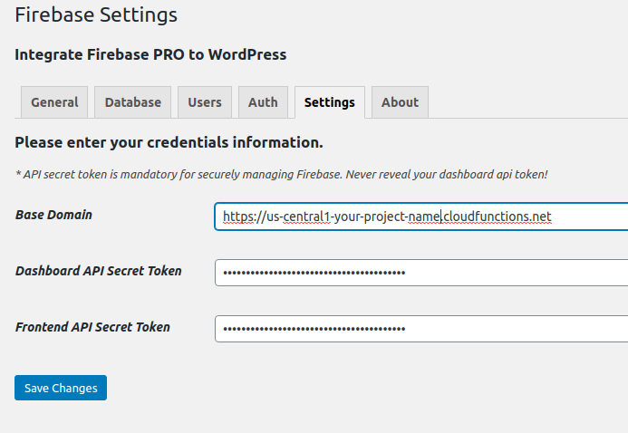

How to integrate Firebase to WordPress
=============

I’m not sure why you want to integrate Firebase and WordPress together because they are two seperate system. The authentication is different too. But somehow, you end up here and want to combine Firebase and WordPress together. And yes, we can do it.

Download the Integrate Firebase PRO plugin
----------------------------------

There is a FREE version of this `Firebase WordPress integration plugin <https://wordpress.org/plugins/integrate-firebase/>`_ that you can find in WordPress plugin site. You can give it a try, however, the application is very limited. If you only want to interact with Firebase through WordPress frontend only, then the free version would be sufficient enough.

However, if you want a more secured and advanced feature of the plugin. Please support the development of `Integrate Firebase PRO <https://firebase.dalenguyen.me>`_ version.

Installation Process
----------------------------------

After you have downloaded the plugin, you can use default installation process in order to install the plugin. Otherwise, you can always manually upload the plugin to your plugin folder through FTP client.

After you activate the plugin, you need to enter the Firebase credential in the **Settings > Firebase**.

.. figure:: images/general.png
    :scale: 70%
    :align: center

    General configuration

After that, you can create login form, show data, show logout button… on WordPress frontend.

Firebase Functions Deployment (PRO version only)
----------------------------------

If you are using PRO version, there is another folder named **firebase-wordpress-functions**. If you want to manage database, Firebase users and custom functions, you should deploy the functions together with the plugin. Make sure that you have Nodejs installed on your machine. 

Before deploying any functions, you should create a token for security purpose. 

.. code-bock:: bash 
    // Generate random token
    node -e "console.log(require('crypto').randomBytes(20).toString('hex'))"

    // Set your token to firebase configuration
    firebase functions:config:set api.token=your-secret-key

    // Check your api token
    firebase functions:config:get api.token

Start deploying firebase functions

.. code-block:: bash
    cd functions
    yarn deploy
    // OR 
    npm run deploy 

The deployment result should look like this

.. code-block:: bash 
    ✔  functions: Finished running predeploy script.
    i  functions: ensuring necessary APIs are enabled...
    ✔  functions: all necessary APIs are enabled
    i  functions: preparing functions directory for uploading...
    i  functions: packaged functions (103.29 KB) for uploading
    ✔  functions: functions folder uploaded successfully
    i  functions: updating Node.js 10 (Beta) function api-user(us-central1)...
    i  functions: updating Node.js 10 (Beta) function api-database(us-central1)...
    ✔  functions[api-user(us-central1)]: Successful update operation. 
    ✔  functions[api-database(us-central1)]: Successful update operation. 

    ✔  Deploy complete!

    Project Console: https://console.firebase.google.com/project/your-project-name/overview
    ✨  Done in 77.56s.

After that, you should update your Firebase setting with the token and firebase functions url (e.g. *https://us-central1-project-name.cloudfunctions.net*)

    Firebase setting

