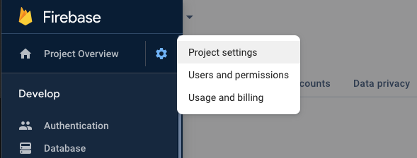
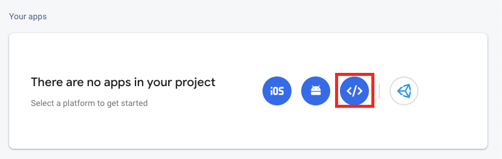
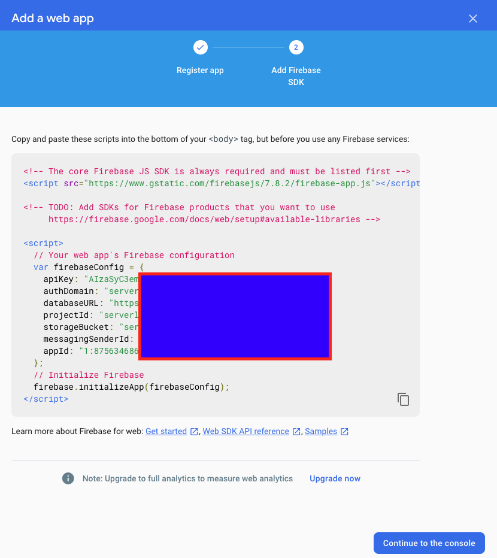
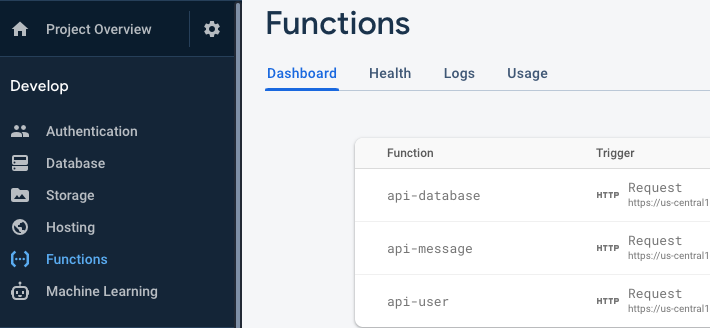

.. raw:: html

    <style> .red {color:red} </style>

How to integrate Firebase to WordPress
=============

.. role:: red

:red:`Please deactivate and remove the Free plugin before installing the Integrate Firebase PRO version.`

Are you looking for 

- Logging to WordPress with Firebase Credentials? 
- Displaying data from Firebase to WordPress? 
- Saving data from WordPress to Firebase?
- Manage Firebase User / Account on WordPress?
- ...

You are in the right place.

Download the Integrate Firebase PRO plugin
----------------------------------

There is a FREE version of this `Firebase WordPress integration plugin <https://wordpress.org/plugins/integrate-firebase/>`_ that you can find in WordPress plugin site. You can give it a try, however, the application is very limited. If you only want to interact with Firebase through WordPress frontend only, then the free version would be sufficient enough.

However, if you want a more secured and advanced feature of the plugin. Please support the development of `Integrate Firebase PRO <https://firebase.dalenguyen.me>`_ version.

Prepare Firebase Credentials
----------------------------------
Before using the plugin, we need have the credentials from Firebase Console. You can get it by logging into https://console.firebase.google.com. 

After signning in, you can navigate to **Project Overview > Project Settings**.



    General configuration

In General tab, you can get the config at the bottom. If you don't have any app ready, you can create a new one. 



    Create a Web app

After creating a web app for you project, you can save your credentials for later usage.



    Firebase Credentials

Installation Process
----------------------------------

After you have downloaded the plugin, you can use default installation process in order to install the plugin. Otherwise, you can always manually upload the plugin to your plugin folder through FTP client.

After you activate the plugin, you need to enter the Firebase credentials in the **Dashboard > Firebase**.

.. figure:: images/general.png
    :scale: 70%
    :align: center

    General configuration

After that, you can create login form, show data, show logout button… on WordPress frontend.

Select Firebase Services - Optimization
----------------------------------

With the new update since v1.1.0 you have to pick the services (General Tab) for optimization purposes. I have choose either Realtime / Firestore or both of them in order to interact with Firebase Database on the frontend.

.. figure:: images/general/firebase-optimization.png
    :scale: 70%
    :align: center

    Firebase Optimization

Firebase Cloud Functions Deployment (PRO version only)
----------------------------------

If you are using PRO version, there is another folder named **firebase-wordpress-functions**. If you want to manage database, Firebase users and custom functions, you should deploy the functions together with the plugin. Make sure that you have Nodejs installed on your machine. 

The cloud functions is only Admin Dashboard tasks, you don't have to deploy the cloud functions for frontend interactions such as login, display or retrieve data.

If you want a hands-on guide, you can watch this tutorial: `How to Deploy Cloud Functions <https://www.youtube.com/watch?v=D-xvzJ9K8jw>`_

Prerequisite
`````````````

In order to deploy cloud functions, you need to have `Nodejs <https://nodejs.org/en/>`_ installed on your machine. 

Then install `firebase-tools <https://firebase.google.com/docs/cli>`_ packaged

.. code-block:: bash

    npm install -g firebase-tools

SignIn and test firebase cli

.. code-block:: bash

    firebase login

Since version 0.6.0, before deploying any functions, you should create two tokens for security purpose. One for Wordpress dashboard usage, the other is for Wordress frontend.

.. code-block:: bash

    // Generate random token
    node -e "console.log(require('crypto').randomBytes(20).toString('hex'))"

    // Set your token to firebase configuration (dashboard token)
    firebase functions:config:set api.dashboard_token=your-secret-key --project project-id

    // Set your token to firebase configuration (frontend token)
    firebase functions:config:set api.frontend_token=your-secret-key --project project-id

    // Check your api token
    firebase functions:config:get api --project project-id

Change Cloud Functions Regions
`````````````

Default functions will be deployed to `us-central1`. If you don't want to change the regions, please skip this part.

In case you want to change the deploy regions to `asia-east2`, you can set a regions configuration for the firebase.

.. code-block:: bash

    // Set deploy regions for `asia-east2`
    firebase functions:config:set regions.0=asia-east2 --project project-id

    // Set deploy regions for `asia-east2` and `us-central1`
    firebase functions:config:set regions.0=asia-east2 regions.1=us-central1 --project project-id

After configuration, please check your environment to make sure that you have the region in the functions config.

.. code-block:: bash

    firebase functions:config:get regions --project project-id

    // The result should looks like this for two regions (asia-east2 & us-central1)
    [
        "asia-east2",
        "us-central1"
    ]

Install Packages & Deploy Cloud Functions
`````````````

Install packages and build functions. I'm using Yarn, you can use npm if you want.

.. code-block:: bash

    cd functions/
    yarn OR npm install

The code will go to *functions* folder, then installs packages with yarn / npm.

Start deploying firebase functions

.. code-block:: bash

    cd functions
    yarn deploy --project project-id
    // OR 
    firebase deploy --only functions --project project-id

The deployment result should look like this

.. code-block:: bash 

    ✔  functions: Finished running predeploy script.
    i  functions: ensuring necessary APIs are enabled...
    ✔  functions: all necessary APIs are enabled
    i  functions: preparing functions directory for uploading...
    i  functions: packaged functions (103.29 KB) for uploading
    ✔  functions: functions folder uploaded successfully
    i  functions: updating Node.js 10 (Beta) function api-user(us-central1)...
    i  functions: updating Node.js 10 (Beta) function api-database(us-central1)...
    ✔  functions[api-user(us-central1)]: Successful update operation. 
    ✔  functions[api-database(us-central1)]: Successful update operation. 

    ✔  Deploy complete!

    Project Console: https://console.firebase.google.com/project/project-id/overview
    ✨  Done in 77.56s.

After that, you should update your Firebase setting with the dashboad token and frontend token and firebase functions url (e.g. *https://us-central1-project-id.cloudfunctions.net*)

.. figure:: images/firebase-setting.png
    :scale: 70%
    :align: center

    Firebase setting

Just to verify that everything works, you can find three cloud functions in your firebase console after the deployment. 



    Firebase cloud functions