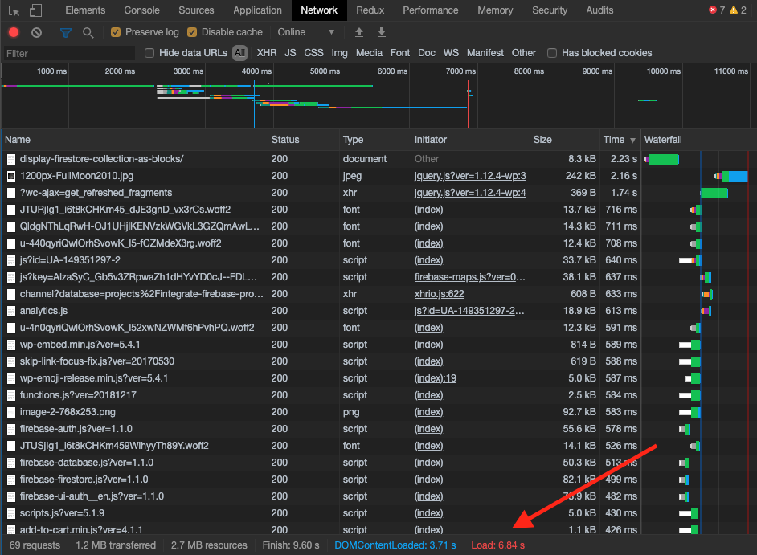
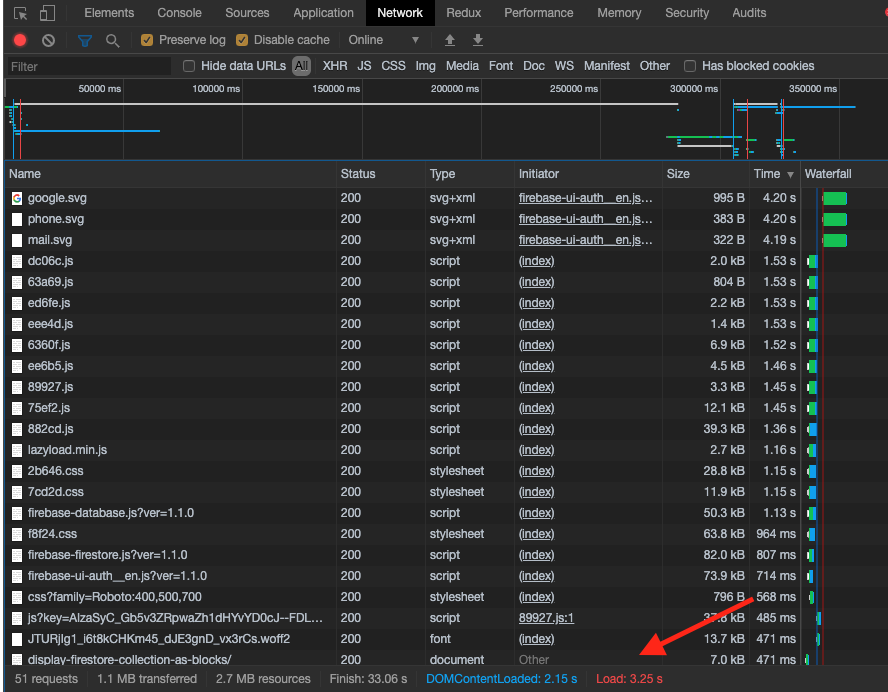

Performance - Optmization
=============

This section will help to optimize the improve the performance of the WordPress & Integrate Firebase PRO plugin. 

There are few options that can improve the performance of your WordPress site.

Pick the Firebase Services
----------------------------------

In general tab, you have to choose which database to use. It's either Realtime or Firestore. I will help to reduce the scripts when loading the site. 

.. figure:: images/general/firebase-optimization.png
    :scale: 70%
    :align: center

    Firebase Optimization

Use a Cache Plugin
----------------------------------

A Cache plugin can help to improve the SEO and user experience of your site by increasing website performance and reducing load times by leveraging features like content delivery network (CDN) integration and the latest best practices. 

In this example, I will `W3 Total Cache <https://wordpress.org/plugins/w3-total-cache/>`_. You can try another one if you like to. However, remember to check if it causes any issue on your site. You can check console log of the browser for any errors. 

.. figure:: images/performance/optimization-preview.png
    :scale: 70%
    :align: center

    W3 Cache Preview 

A Preview option will help check for any arror before publishing the changes.

After configuration, here is the result. The load time reduces about 50% from 6.84s -> 3.25s.

    Before optimization 

    After optimization     