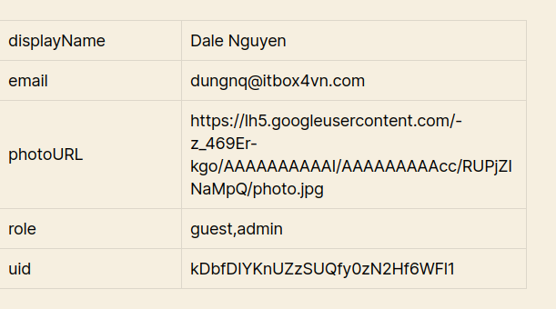
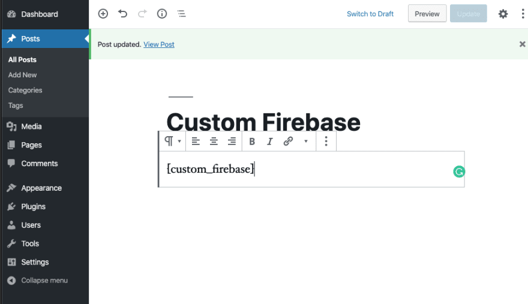
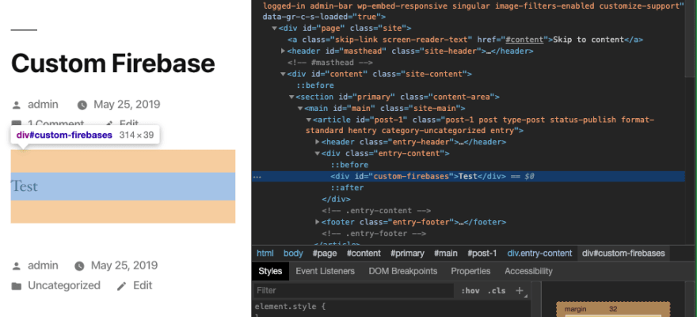
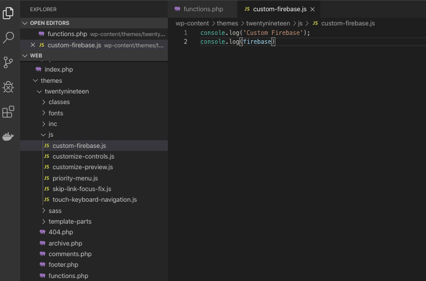
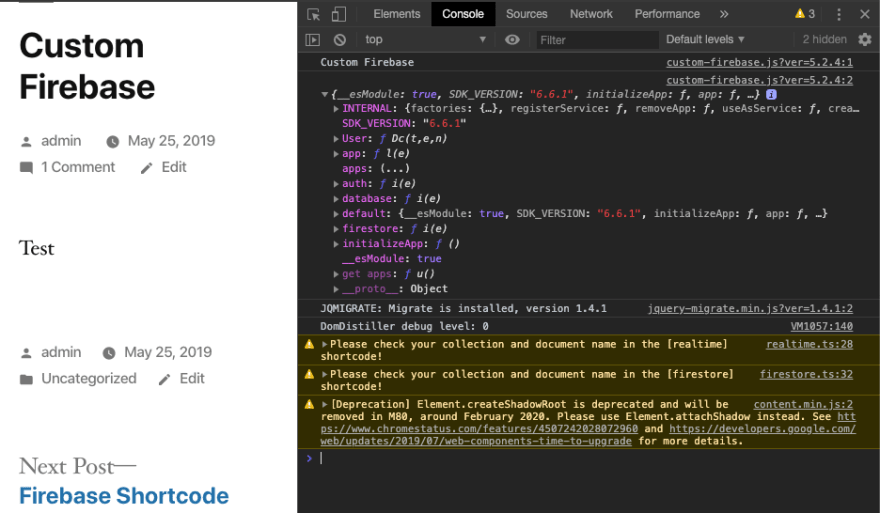
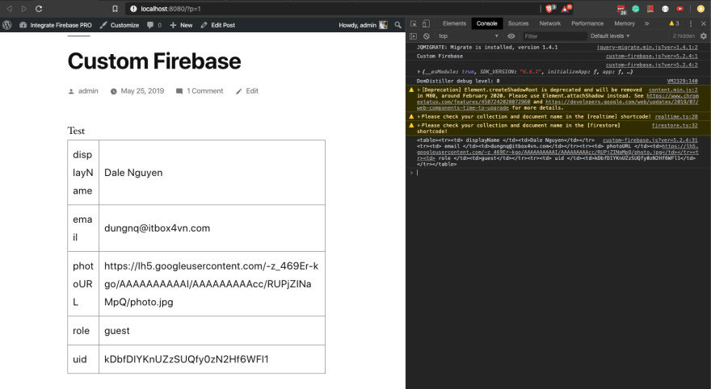

How to Retrieve Data from Firestore and Display on WordPress
=============

In this tutorial, I will show you how to retrieve the database from your Firestore and display it on the WordPress website. Before that, make sure you have:

- Install and active Integrate Firebase plugin
- Update the firebase configuration on the Firebase dashboard
- Make sure that Firebase security rules allow you to access the document with or without logging in

The plugin support getting one document and display on the frontend as a table with the shortcode. 

.. code-block:: php

    // Get document id '1' from 'users' collection from realtime database
    [realtime class='your-class-name' collection_name='users' document_name='1']

    // Get document id '1' from 'users' collection from firestore
    [firestore class='your-class-name' collection_name='users' document_name='1']

    Display data from firebase

If the default shortcode doesn't suite your needs, you can create a custom one. Please follow the guide below.

Step 1: Create a custom shortcode
----------------------------------

You can do this by edit functions.php in your current theme

.. code-block:: php

    // functions.php

    // custom firebase short code 
    function custom_firebase_func($atts)
    {
        return "
Test
";
    }
    add_shortcode('custom_firebase', 'custom_firebase_func');

Add the shortcode on a page or post

    Custom Firebase Shortcode

    Custom Firebase Shortcode Frontend

Step 2: Add custom javascript file
----------------------------------

Again, you can do this by editing your functions.php

.. code-block:: php

    // functions.php

    // Custom JavaScript for Firebase
    function custom_firebase_scripts_function()
    {
    wp_enqueue_script('custom_firebaes', get_template_directory_uri() . '/js/custom-firebase.js', array('firebase_app', 'firebase_auth', 'firebase_database', 'firebase_firestore', 'firebase'));
    }
    add_action('wp_enqueue_scripts', 'custom_firebase_scripts_function');

Your custom-firebase.js will be under js/ folder

    Custom Firebase Location

Verify it on the front-end. You have access to firebase now.

    Verify custom firebase on frontend

Custom JS shows

Step 3: Retrieve and display data from Firestore
----------------------------------

Now, it’s all about JavaScript. You can customize, modify and do whatever you want.

.. code-block:: javascript

    (function ($) {
        'use strict';
        $(document).ready(function () {
            const showFirestoreDatabase = () => {
                const db = firebase.firestore();
                const firestoreEl = jQuery('#custom-firebase');

                // You can get the collectionName and documentName from the shortcode attribute
                const collectionName = 'users';
                const documentName = ‘document-1'

                if (collectionName && documentName) {
                    const docRef = db.collection(collectionName).doc(documentName);

                    docRef.get().then(doc => {
                        if (doc.exists) {
                            // console.log('Document data:', doc.data());
                            let html = '<table>';
                            jQuery.each(doc.data(), function (key, value) {
                                // You can put condition to filter your value
                                // and it won't show on the frontend
                                html += '<tr>';
                                html += `<td> ${String(key)} </td>`;
                                html += '<td>' + value + '</td>';
                                html += '</tr>';
                            })
                            html += '</table>';
                            firestoreEl.append(html)
                        } else {
                            // doc.data() will be undefined in this case
                            console.error('Please check your collection and document name in the [firestore] shortcode!');
                        }
                    }).catch(error => {
                        console.error('Please check your collection and document name in the [firestore] shortcode!', error);
                    });
                } else {
                    console.warn('Please check your collection and document name in the [firestore] shortcode!');
                }
            }

            showFirestoreDatabase()
        })
    })(jQuery)

Check the code on the WordPress post.

    Firestore data retrieved

Yay, firestore data is retrieved