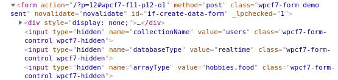
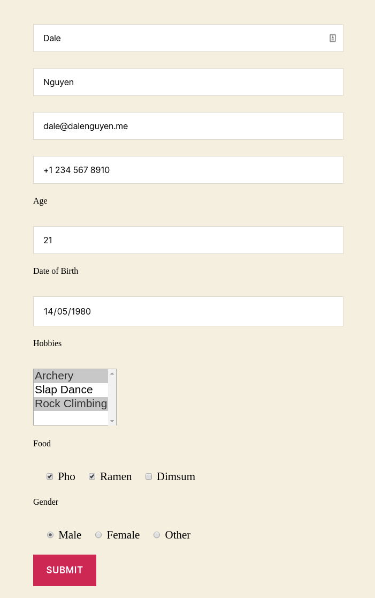
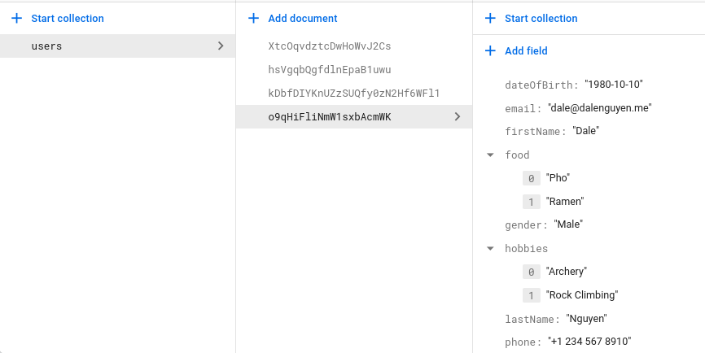

How to Save Data from WordPress to Firebase (Realtime + Firestore)
=============

In this guide, I will show you how to add new data to Realtime database Firestore. In this example, I use `Contact Form 7 <https://wordpress.org/plugins/contact-form-7/>`_, but you feel free to design your own form or use other plugin. 

The reason that I use Contact Form 7 is because it's the most popular form in WordPress plugin. It is well supported and highly customisation. You don't have to worry about form validation or email handling after submitting a form.

If you decide to create your own custom form, remember to add "if-create-data-form" as an ID to your form, together with the hidden fields below.

    Custom Create Form

Example of creating new form and writing data to Firestore
----------------------------------

Sample of data that I will use to update to Firestore

.. code-block:: bash

    export interface Contact {
        firstName: string
        lastName: string
        email: string
        phone: string
        age: string
        dateOfBirth: string
        hobbies: array<string>
        food: array<string>
        gender: string
    }

From that you can create a sample form in Contact tab. The hidden fields are important. 

[hidden collectionName "users"]  -> collection name is users
[hidden databaseType "firestore"] -> data will be saved in firestore
[hidden arrayType "hobbies,food"] -> array data should be added to arrayType field

.. code-block:: bash

    [hidden collectionName "users"]
    [hidden databaseType "firestore"]
    [hidden arrayType "hobbies,food"]

    [text* firstName placeholder "First Name"]
    [text* lastName placeholder "Last Name"]
    [text* email placeholder "Email"]
    [tel phone placeholder "+1 647 620 0000"]

    <label for="age">Age</label>
    [number age id:age min:1 max:100]

    <label for="dateOfBirth">Date of Birth</label>
    [date* dateOfBirth id:dateOfBirth]

    <label for="hobbies">Hobbies</label>
    [select* hobbies id:hobbies multiple "Archery" "Slap Dance" "Rock Climbing"]

    <label for="food">Food</label>
    [checkbox food id:food "Pho" "Ramen" "Dimsum"]

    <label for="gender">Gender</label>
    [radio gender id:gender default:1 "Male" "Female" "Other"]

    [submit id:if-data-submit "Submit"]

The shortcode will be added to the WordPress page or post. With the  id: "if-create-data-form". The id is important in order for the plugin to save the data to firebase.

.. code-block:: bash

    [contact-form-7 id="11" html_id="if-create-data-form" title="Contact form 1"]

    Sample form on frontend

After submitting, data will be saved to Firestore

    Data saved to firestore

Example of creating new form and writing data to Realtime
----------------------------------

If you want to save data to Realtime database, the only thing that you need to change is the databaseType hidden field.

.. code-block:: bash

    [hidden databaseType "realtime"]

If there form is valid, the data will be saved to realtime database

.. figure:: images/database/saved-to-realtime.png
    :scale: 70%
    :align: center

    Data saved to realtime

Addition Settings
----------------------------------

Contact form 7 comes with extra configurations. If you don't want to send a confirmation email to customers, you can this line to the addition settings.

.. code-block:: bash
    
    skip_mail: on

Reference
----------------------------------

https://contactform7.com/additional-settings/
https://contactform7.com/hidden-field/