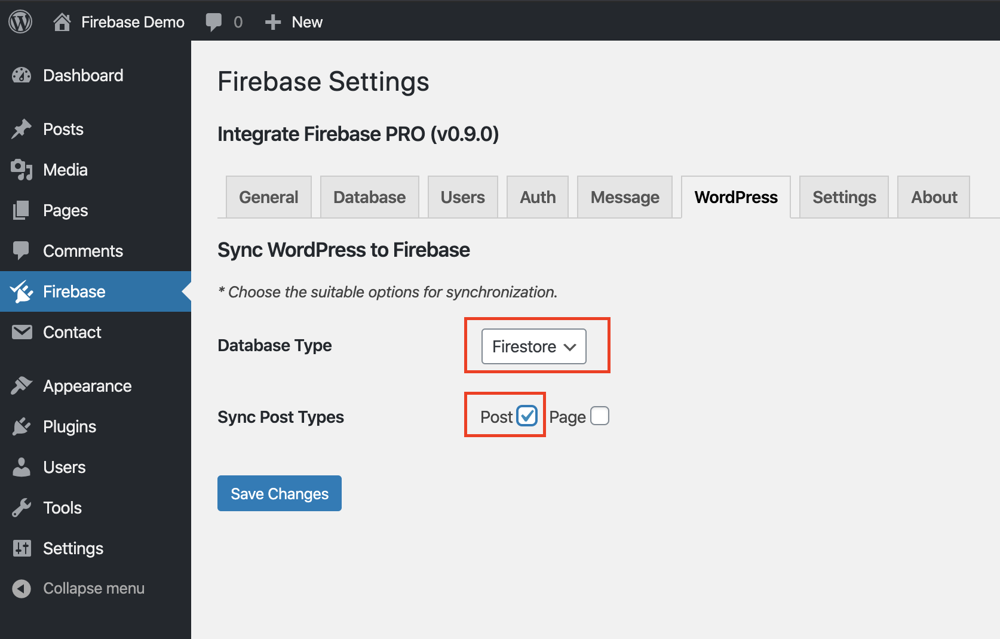
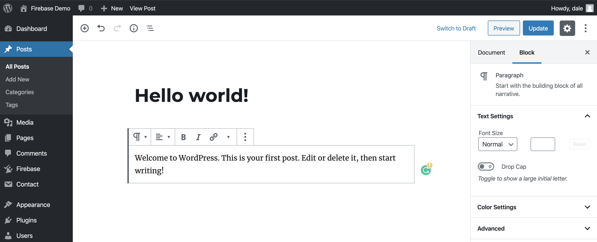
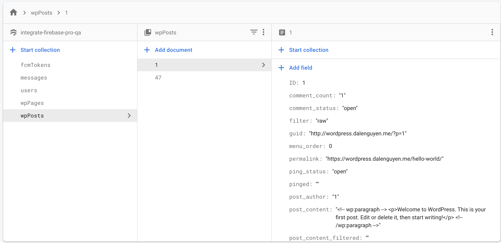

Sync Data from WordPress to Firebase
=============

Since version 0.9.0, I added some event triggers for syncing data from WordPress to Firebase. The plugin now supports syncing Post & Page from WordPress to Firebase. That means when you add or update a new Post or Page. The content will be updated automatically to Firebase (Realtime / Firestore). 

+ For posts, they locate under **wpPosts** collection name. 
+ For pages, they locate under **wpPages** collection name.

1. Setting Up
----------------------------------

Make sure the version of the plugin is at least: v0.9.0. Then you can choose which type of data to sync to Firebase. 

    Synchronization configuration

In this example, it will choose Firetore as the database, and every new or update posts will be synced to Firestore. You can choose both Post & Page type.

2. Create a Sample Post
----------------------------------

After that, you can create a new post or update an existing one.

    Create a new post

After you save, the post will be added to Firestore. The document id of the post is also the post id for query purpose.

    New post in firestore

When you update the current post, it will override the data in the firestore to make sure that it always updated.