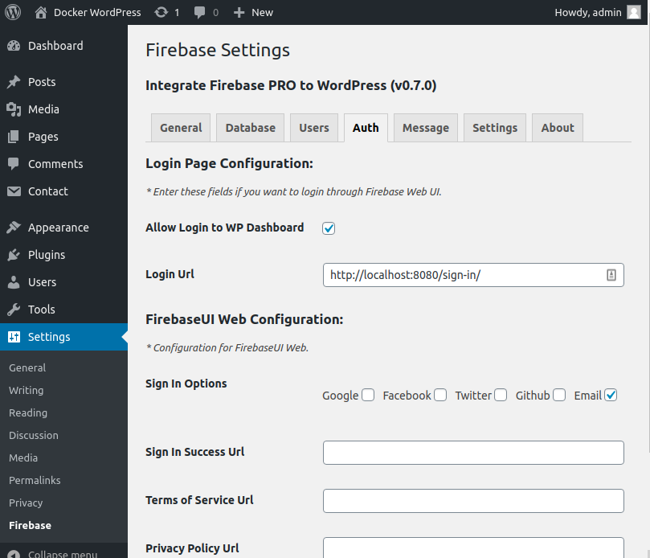
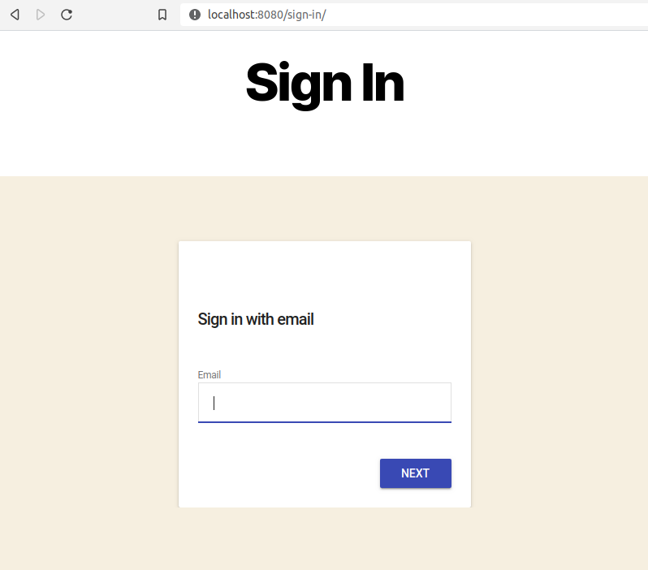

WordPress User Integration (Not Realease Yet)
=============

This feature is available since **v0.7.0**. There are a lots of tasks that needs to be done in order to make the integration much better for WordPress and Firebase Users because they are in two separate systems.

This feature solves the authentication problem. This is an example from one of my potential clients. The client has a mobile app (Firebase users), and they want those users to login to a separate WordPress website without registering again. 

And this plugin can help you to achieve just that.

At this stage, it helps to authenticate to WordPress dashboard with a subscriber role. *However, if users change password either in Firebase or WordPress, the authenticate doesn't really work, because the password is different now*. I will update the changing password synchronization in the next version.

How to Login to WP Dashboard with Firebase Users
----------------------------------

This flow will utilize FirebaseUI Web workflow in order to authenticate users. In order to that, you have to log in to WordPress Dashboard, then **Settings > Firebase > Auth**.

    Firebase Auth Settings

Check **"Allow Login to WP Dashboard"** and enter you **Login Url**. It could be your homepage or a separate page just for logging in. From now, everytime users navigate to https://your-webiste.com/wp-login, it will redirect to your new login page.

This page will contain the shortcode for logging in.

.. code-block:: php

    // Login, Register through FirebaseUI Web
    [firebaseui_web][/firebaseui_web]

    New WP Login Page

After users log in, it will create a new user in WordPress if the user doesn't exist. Then authenticate it to WordPress dashboard automatically.

When users log out from dashboard, that means they will also be logged out to Firebase.